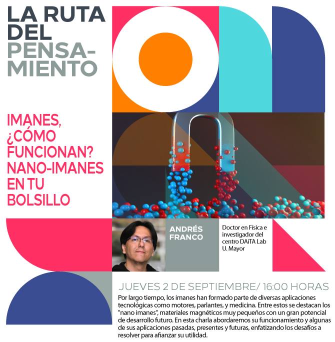
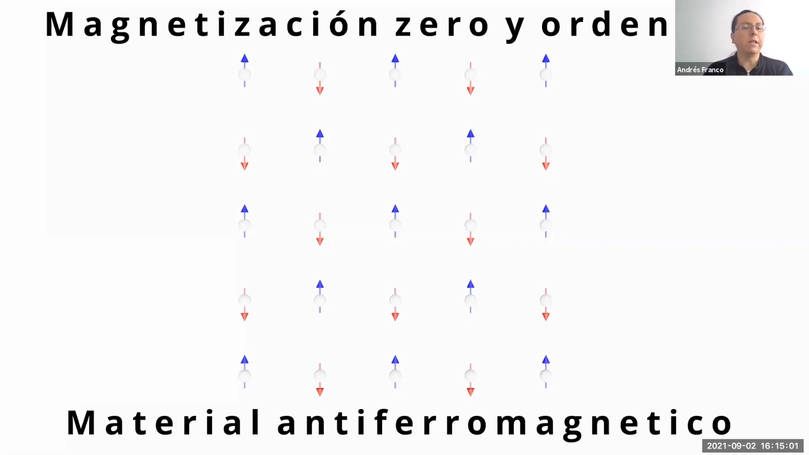
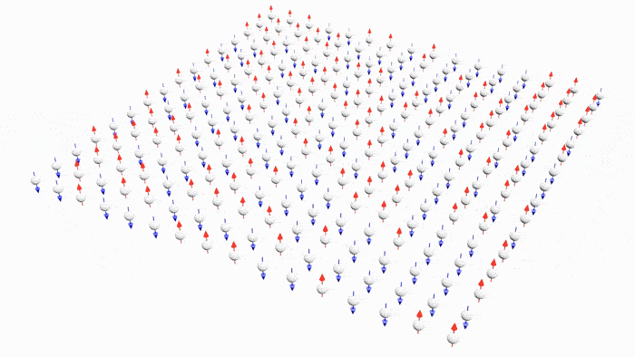

# 3D spins animations in Blender

## About this repo
This repository contains code written during Universidad Mayor's Vertically Integrated Project **Python animations for applications in nanomagnetism**. [Read more](https://cib.umayor.cl/en/news/vip-projects-the-tool-that-fosters-the-link-between-undergraduate-and-research-carried-out-in-the-u-mayor). It is meant to help physics researchers create spins animations in Blender.

A demo has been left in the ``src`` folder. It creates an animation based on the output of a cellular automata algorithm that writes 2D spins matrices into the ``matrices`` folder, using keyframe information from the ``config.json`` file.

There's still a lot of work to be done and any contribution is appreciated. Feel free to use this in a project and please let us know if you do! 

## Featured in:

<table>
  <tr>
    <td></td>
    <td></td>
   </tr> 
</table>

Watch it here: https://youtu.be/GGVQO_T5GWs?t=701
  
## Acerca de este repo
El contenido que se encuentra dentro de este repositorio corresponde al código realizado durante el proyecto VIP de **Animaciones en Python para aplicaciones en nanomagnetismo** de la Universidad Mayor. [Leer más](https://cib.umayor.cl/news/proyectos-vip-la-herramienta-que-fomenta-la-vinculaci%C3%B3n-entre-el-pregrado-y-la-investigaci%C3%B3n-que-se-realiza-en-la-u-mayor). Su propósito es ayudar a que investigadores creen animaciones acerca de espines en Blender.
      
Se ha dejado una demo en la carpeta ``src``. Esa demo crea una animación basada en el output de un algoritmo autómata celular que escribe matrices 2D de espines en la carpeta ``matrices``, permitiendo la configuración de la animación en el archivo ``config.json``.
      
Hay bastantes cosas que se pueden trabajar y cualquier contribución es agradecida. Avísanos si usas este código en algún proyecto! 😊

       <a href="https://www.youtube.com/watch?v=jqwrRr0v59k">https://www.youtube.com/watch?v=jqwrRr0v59k</a>

