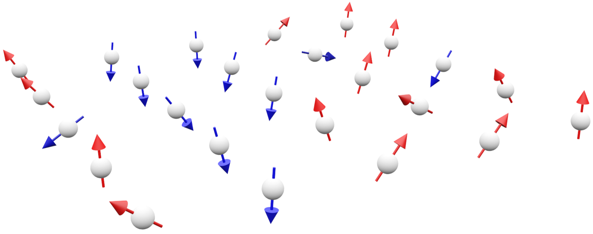

<p align="center">

</p>

# 3D spins animations in Blender

## About this repo
This repository contains Python code written during Universidad Mayor's Vertically Integrated Project **Python animations for applications in nanomagnetism**. [Read more](https://cib.umayor.cl/en/news/vip-projects-the-tool-that-fosters-the-link-between-undergraduate-and-research-carried-out-in-the-u-mayor). It is meant to help physics researchers create spins animations in Blender.

A demo has been left in the ``src`` folder. It creates an animation based on the output of a cellular automata algorithm that writes 2D spins matrices into the ``matrices`` folder, using keyframe information from the ``config.json`` file.

There's still a lot of work to be done and any contribution is appreciated. Feel free to use this in a project and please let us know if you do!

## Featured in:

<table>
  <tr>
    <td></td>
    <td><a href="https://youtu.be/GGVQO_T5GWs?t=701"></a></td>
   </tr> 
</table>

Watch it here: https://youtu.be/GGVQO_T5GWs?t=701
  
## Acerca de este repo
El código que se encuentra dentro de este repositorio corresponde al código que realicé durante el proyecto VIP de **Animaciones en Python para aplicaciones en nanomagnetismo** de la Universidad Mayor. [Leer más](https://cib.umayor.cl/news/proyectos-vip-la-herramienta-que-fomenta-la-vinculaci%C3%B3n-entre-el-pregrado-y-la-investigaci%C3%B3n-que-se-realiza-en-la-u-mayor). Importante considerar que el proyecto está en una etapa de desarrollo inicial.

Para hacer que el código funcione dentro de un proyecto de Blender, debes almacenar los archivos en la misma carpeta que el archivo .blend y agregar el siguiente texto en la ventana del proyecto llamada Text Editor, de la pestaña Scripting. Carga el archivo demo.py.

```python
import bpy
import os
import sys

sys.path.append(bpy.path.abspath("//"))
filename = os.path.join(os.path.dirname(bpy.data.filepath), "demo.py") 
exec(compile(open(filename).read(), filename, 'exec'))
```

<p align="center">

</p>
